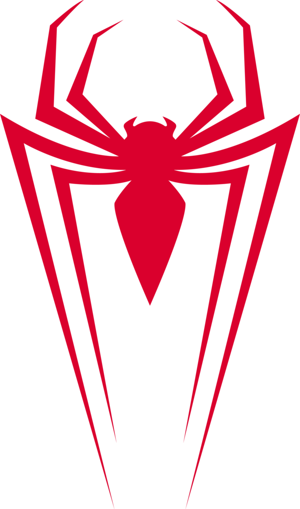

# Spider-Man: Cinematic Web Experience



A high-performance, cinematic 3D scrolling experience dedicated to Spider-Man. This project leverages WebGL and frame-by-frame canvas animations synced to scroll events, creating a deeply immersive storytelling environment. 

🌐 **Live Demo:** [spiderman.nikethan.qzz.io](https://spiderman.nikethan.qzz.io)

**Live 404 Page Demo:** https://spiderman.nikethan.qzz.io/404.html

---

## 🕷️ Features

- **Frame-by-Frame Scroll Scrubbing:** Cinematic 3D renders that play, reverse, and scrub smoothly perfectly in sync with your mouse wheel.
- **WebGL Post-Processing:** Utilizes Three.js for real-time visual effects including Unreal Bloom, AcesFilmic Tone Mapping, and high-fidelity rendering.
- **3D Dome Gallery:** An interactive, immersive gallery experience constructed with Three.js `GLTFLoader`.
- **Cinematic 404 Page:** A fully custom "Dimensional Anomaly" error page with GSAP-powered glitch typography and HUD elements.

## 🛠️ Tech Stack

- **HTML5 & CSS3** - Modern, responsive structure and styling.
- **Vanilla JavaScript (ES6 Modules)** - Clean, dependency-lite logic architecture.
- **[Three.js](https://threejs.org/)** - For 3D scenes, WebGL rendering, and post-processing pipelines.
- **[GSAP (GreenSock)](https://gsap.com/)** - Advanced timeline animations and `ScrollTrigger` for tying canvas sequences to scroll positions.

## 🚀 Getting Started

Since this project relies on ES6 modules (`type="importmap"`), it cannot be run simply by double-clicking the `index.html` file due to browser CORS policies.

**To run the project locally:**

1. Clone the repository:
   ```bash
   git clone https://github.com/NikethanMukkala/SpiderMan.git
   cd SpiderMan
   ```
2. Start a local development server. You can use VS Code's "Live Server" extension, or Node's `npx serve`:
   ```bash
   npx serve .
   ```
3. Open `http://localhost:3000` (or the port provided by your server) in your browser.

## 📁 Project Structure

- `index.html`: The main entry point containing the canvas wrappers and DOM structure.
- `app.js`: Initializes Three.js WebGL rendering, post-processing pipelines, and Lenis smooth scrolling.
- `script2.js`: Handles the frame-by-frame canvas extraction logic and GSAP ScrollTrigger scrubbing for the main sequences.
- `style.css`: Core typography, layout, and component styling.
- `404.html`: The custom spider-suit HUD error page.
- `/Page5`: Embedded sub-page housing the interactive Tom Holland spotlight section.
- `/Assets`: Houses all baked image sequences, 3D models (`.glb`), and UI elements.

## 🤝 Contributing

Contributions, issues, and feature requests are welcome!
Feel free to check [issues page](https://github.com/NikethanMukkala/SpiderMan/issues).

## 📝 License

This project is intended for educational and portfolio purposes. Spider-Man and related characters are property of Marvel and Sony. 

---
*Crafted by [Nikethan Mukkala](https://github.com/NikethanMukkala)*
